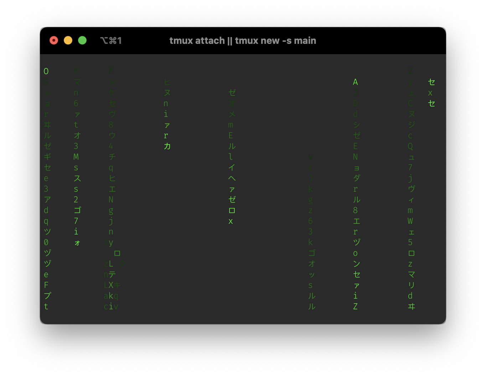

# Matrix

*A screensaver but for the command line.*

---




## What is it?
Matrix was originally just a program to output a matrix-style rain effect to the console. I created it because I had just installed tmux, and thought it would look cool to be editing something in vim in one pane and having a matrix effect in another (and I was right :D). I'm always looking to add more effects and customization, because why not, it's cool.

## Installation

Currently, the only way to install matrix is by building from source.

```bash
git clone https://github.com/PepperLola/matrix.git
cd matrix
go build
```

Then, move the resulting matrix executable to somewhere in your `$PATH`, or add the repository directory to your `$PATH`.

## Usage

To use matrix in matrix mode, with the default configuration, simply run

```bash
matrix
```

All of the options are in the form of command line arguments, a complete list of these arguments can be found by running `matrix --help`, should this README not be up to date.

|Argument    |Description                                                                                                                            |Type                    |Default           |Example                                           |
|------------|---------------------------------------------------------------------------------------------------------------------------------------|------------------------|------------------|--------------------------------------------------|
|`--mode`    |Which mode to run; determines the pattern shown.                                                                                       |`matrix`, `image`, `gif`|`matrix`          |`matrix --mode gif`                               |
|`--path`    |Filepath to the image or gif to load in image or gif mode.                                                                             |String                  |`./test.png`      |`matrix --mode gif --path ~/Desktop/animation.gif`|
|`--scale`   |Scale to render the image at.                                                                                                          |Float64                 |Auto              |`matrix --mode gif --scale 0.5`                   |
|`--interval`|Number of frames between matrix line spawns in matrix mode.                                                                            |Integer                 |10                |`matrix --interval 1`                             |
|`--alphabet`|Custom character set to choose from in matrix mode.                                                                                    |String                  |Kana + Latin + 0-9|`matrix --alphabet 013456789`                     |
|`--word`    |Causes matrix lines to go consecutively through the provided alphabet instead of randomly. Useful for making lines write specific text.|Boolean                 |false             |`matrix --alphabet helloworld --word`             |
|`--fps`     |Frame updates per second of the pattern.                                                                                               |Integer                 |10                |`matrix --fps 100`                                |
